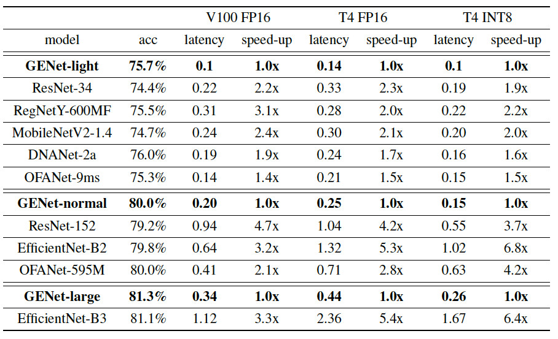

[](https://arxiv.org/abs/2006.14090)

# Merge to New Project Zen-NAS

This project is obsoleted and the development is merged into our ICCV 2021 work Zen-NAS. The new Github repository is [[here]](https://github.com/idstcv/ZenNAS).

# GENet: A GPU-Efficient Network

A new deep neural network structure specially optimized for high inference speed on modern GPU. 
It uses full convolutions in low-level stage and depth-wises convolutions in high-level stages.

More details could be found in our arXiv preprint: 

Ming Lin, Hesen Chen, Xiuyu Sun, Qi Qian, Hao Li, Rong Jin. **Neural Architecture Design for GPU-Efficient Networks.** arXiv:2006.14090 [cs.CV]. June 2020. [[arXiv]](https://arxiv.org/abs/2006.14090)

If you find it useful, please help us by citing this work as following:

```text
@misc{lin2020neural,
    title={Neural Architecture Design for GPU-Efficient Networks},
    author={Ming Lin and Hesen Chen and Xiuyu Sun and Qi Qian and Hao Li and Rong Jin},
    year={2020},
    eprint={2006.14090},
    archivePrefix={arXiv},
    primaryClass={cs.CV}
}
```

## Pre-Trained Models

We provided three pre-trained models, GENet-large/normal/small.

### GENets Accuracy v.s. Speed


### GENets Speed-Up on V100/T4
 



### Requirements

+ Install [PyTorch](https://pytorch.org/) and [NVIDIA Apex](https://github.com/NVIDIA/apex) (optional).
+ Prepare ImageNet dataset. By default the data root directory is assumed to be ~/data/imagenet.
That is, ~/data/imagenet/train/ contains the training set and ~/data/imagenet/val contains the validation set.
  + The ImageNet downloading script could be found [here](https://github.com/pytorch/examples/tree/master/imagenet).  
+ Clone this repository:
  
```bash
git clone https://github.com/idstcv/GPU-Efficient-Networks.git
cd GPU-Efficient-Networks
```

+ The pre-trained weights should be automatically downloaded to ./GENet_params once you load the model.

### Evaluate the Pre-trained Model

```bash
python val.py --data ~/data/imagenet --arch GENet_large --params_dir ./GENet_params/ --use_apex
```

If you don't have Apex installed, turn-off the --use_apex option. Use '--arch GENet_large', '--arch GENet_normal', '--arch GENet_small'
to choose different GENets.

**Warning:** Without Apex installed, the accuracies of the pre-trained models will be slightly different due to the 
difference in the FP16 quantization.  

## Fine-Tuning GENets on Target Dataset

First, load pre-trained GENets:

```python
import GENet
import torch
from torch import nn
arch = 'GENet_large'
if arch == 'GENet_large':
    input_image_size = 256
    model = GENet.genet_large(pretrained=True, root='./GENet_params/')
if arch == 'GENet_normal':
    input_image_size = 192
    model = GENet.genet_normal(pretrained=True, root='./GENet_params/')
if arch == 'GENet_small':
    input_image_size = 192
    model = GENet.genet_small(pretrained=True, root='./GENet_params/')
``` 

Note GENet-large/normal/small use different input image resolutions.

Then, create your own FC-head:

```python
# number of classes in your target dataset
num_classes = 10
model.fc_linear = nn.Linear(model.last_channels, num_classes, bias=True)
```

If you use GPU 0 for fine-tuning:

```python
gpu = 0
torch.cuda.set_device(gpu)
model = model.cuda(0)
```

To inference,

```python
x = get_one_image_from_your_dataset(input_image_size=input_image_size)
x = x.cuda(gpu)
output = model(x)
```


# License
Copyright (C) 2010-2020 Alibaba Group Holding Limited. Released under the Apache License.
